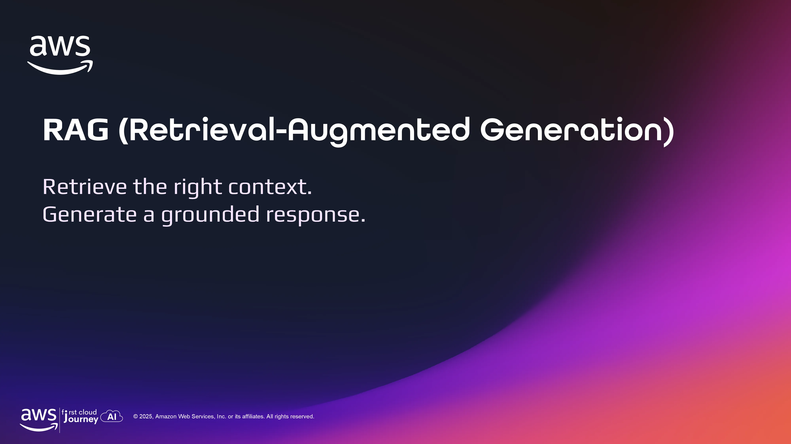

RAG (Retrieval-Augmented Generation) là cách kết hợp khả năng tìm kiếm thông tin với khả năng diễn đạt của foundation model. Thay vì yêu cầu model tự nhớ mọi thứ, hệ thống tìm context phù hợp từ nguồn dữ liệu bên ngoài rồi dùng context đó làm cơ sở cho câu trả lời.

## 2. Foundation model có thể không biết câu trả lời

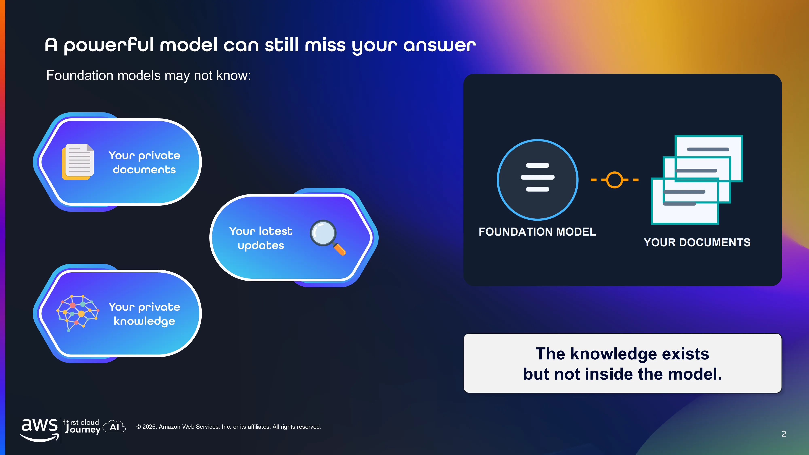

Foundation model được huấn luyện trên một tập dữ liệu lớn, nhưng điều đó không có nghĩa là model biết dữ liệu riêng của tổ chức, tài liệu mới cập nhật hoặc thông tin chỉ xuất hiện sau thời điểm training. Đây là khoảng cách giữa **kiến thức model đã học** và **kiến thức ứng dụng thực sự cần sử dụng**.

Việc model trả lời trôi chảy cũng không chứng minh rằng model có dữ kiện cần thiết. Nếu không có context phù hợp, model có thể suy đoán dựa trên các mẫu ngôn ngữ quen thuộc và tạo ra một câu trả lời nghe hợp lý nhưng không liên quan đến tài liệu thật.

## 3. Retrieval-Augmented Generation

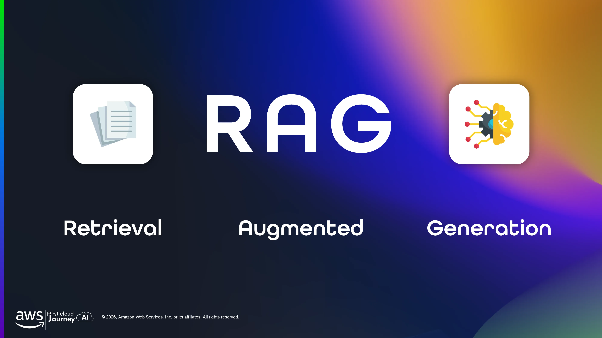

- **Retrieval:** tìm những phần dữ liệu có khả năng trả lời câu hỏi, thay vì gửi toàn bộ kho tài liệu vào prompt.
- **Augmented:** đặt các phần dữ liệu được chọn vào ngữ cảnh của request, để model có thêm bằng chứng đầu vào.
- **Generation:** dùng khả năng hiểu và diễn đạt của model để tổng hợp context thành câu trả lời.

Ba bước này có vai trò khác nhau. Retrieval chịu trách nhiệm tìm đúng thông tin; augmentation nối thông tin đó với câu hỏi; generation biến thông tin thành ngôn ngữ tự nhiên. Vì vậy, RAG không biến model thành một database và cũng không phải là quá trình retrain model.

## 4. RAG giữ ba thành phần tách biệt

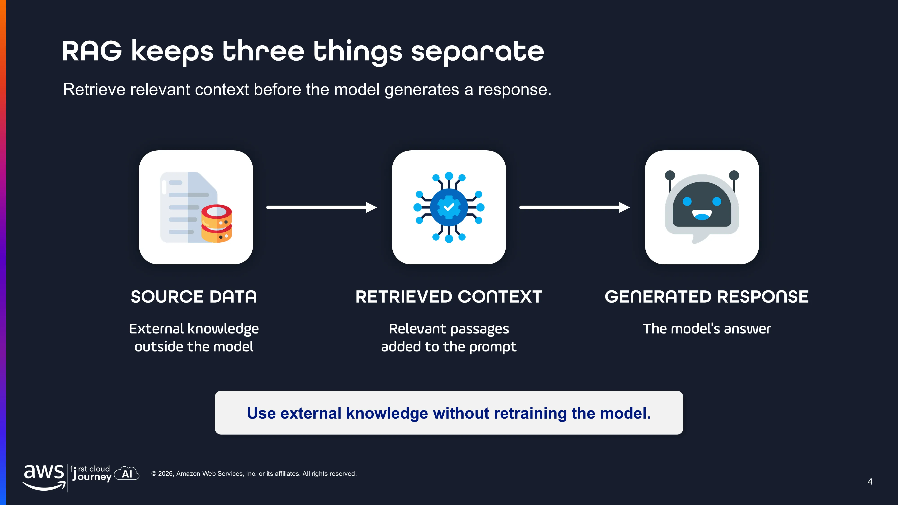

1. **Source data:** dữ liệu gốc, chẳng hạn tài liệu nội bộ, chính sách hoặc các bản cập nhật.
2. **Retrieved context:** một tập con được chọn từ source data dựa trên câu hỏi hiện tại.
3. **Generated response:** diễn giải của model dựa trên context được cung cấp.

Sự phân tách này rất quan trọng khi đánh giá kết quả. Một câu trả lời sai có thể bắt nguồn từ source data lỗi thời, retrieval chọn nhầm passage, hoặc model diễn giải không đúng context. Nếu gộp cả ba thành “kiến thức của AI”, ta sẽ khó biết cần cải thiện phần nào.

RAG cho phép sử dụng external knowledge mà không cần retrain model.

## 5. RAG cá nhân hóa câu trả lời

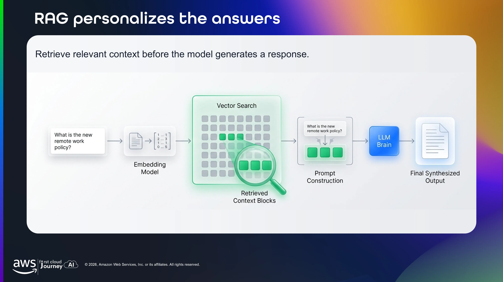

Khi người dùng đặt câu hỏi, câu hỏi được biểu diễn thành vector để hệ thống có thể so sánh ý nghĩa với các đoạn đã được lập chỉ mục. Vector search trả về một số context blocks gần nhất; prompt construction ghép câu hỏi với các đoạn này; LLM sau đó tổng hợp chúng thành output.

Điểm quan trọng là hệ thống không cần đưa toàn bộ tài liệu vào mọi request. Chỉ những phần có liên quan mới được chọn, giúp prompt tập trung hơn và làm cho việc sử dụng private hoặc frequently changing knowledge thực tế hơn.

## 6. Chuẩn bị knowledge trước câu hỏi đầu tiên

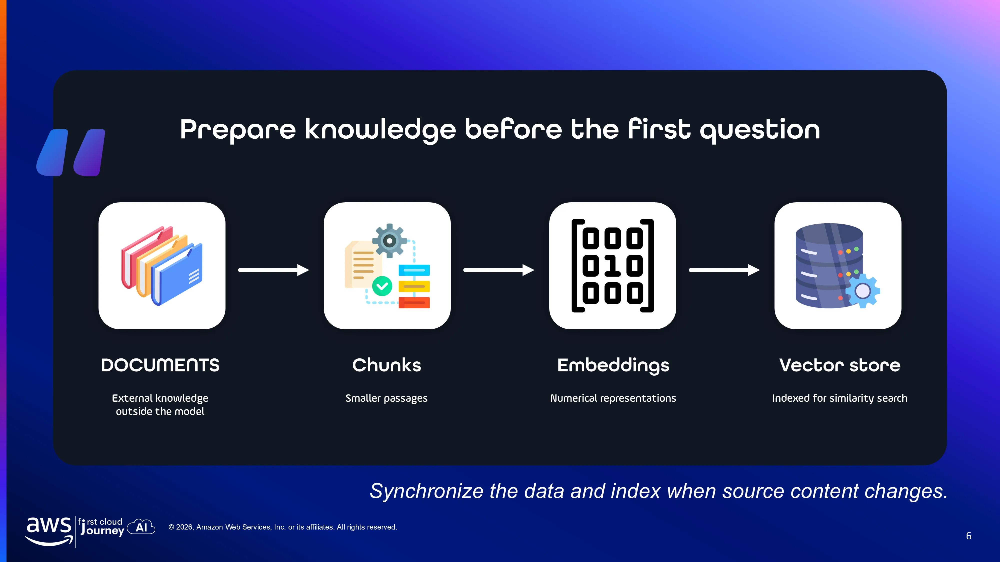

RAG có một phần việc diễn ra trước khi có câu hỏi và một phần diễn ra khi người dùng truy vấn. Trong giai đoạn chuẩn bị, quy trình gồm:

`Documents → Chunks → Embeddings → Vector store`

- **Documents:** external knowledge bên ngoài model.
- **Chunks:** các passage nhỏ hơn.
- **Embeddings:** biểu diễn số của nội dung.
- **Vector store:** nơi được lập chỉ mục để similarity search.

Chunking quyết định đơn vị thông tin mà hệ thống có thể lấy lại. Chunk quá lớn có thể chứa nhiều nội dung thừa; chunk quá nhỏ có thể làm mất mối liên hệ giữa các ý. Sau đó embedding biến mỗi chunk thành một tọa độ trong không gian ý nghĩa, còn vector store giữ các tọa độ cùng metadata để truy vấn nhanh.

Khi source content thay đổi, embeddings và index cũng cần được đồng bộ. Nếu không, hệ thống có thể retrieve một phiên bản cũ dù tài liệu hiện tại đã được cập nhật.

## 7. Embeddings hoạt động như thế nào?

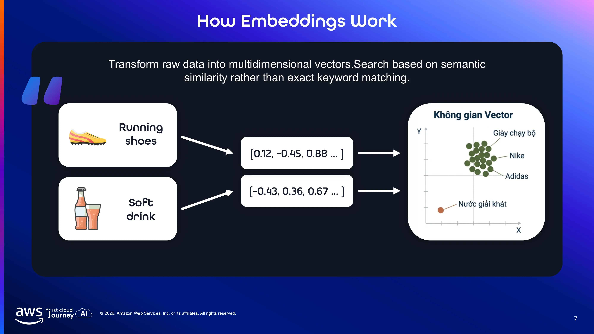

Embedding biến một đoạn văn bản thành một vector nhiều chiều, trong đó các con số không mang ý nghĩa độc lập như từ khóa mà cùng nhau mô tả các đặc điểm ngữ nghĩa của đoạn văn. Hệ thống có thể dùng biểu diễn này để so sánh câu hỏi với tài liệu.

Nhờ semantic similarity, câu hỏi và tài liệu vẫn có thể được xem là liên quan khi dùng từ khác nhau nhưng nói về cùng một ý. Đây là khác biệt giữa semantic search và exact keyword matching. Tuy nhiên, embedding không “hiểu” tài liệu theo nghĩa con người; chất lượng kết quả còn phụ thuộc vào model embedding, cách chunking và ngữ cảnh được giữ lại.

## 8. Số chiều của vector là một trade-off

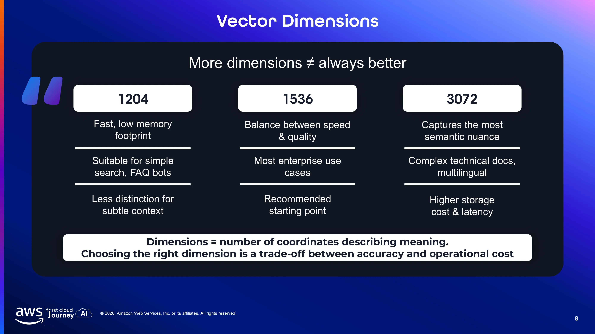

Số dimensions là số tọa độ dùng để biểu diễn một vector. Nhiều dimensions hơn có thể giữ được nhiều sắc thái ngữ nghĩa hơn, nhưng cũng làm tăng dữ liệu phải lưu trữ và xử lý. Vì vậy, đây là một trade-off chứ không phải cuộc đua chọn con số lớn nhất:

- **1204:** nhanh, ít memory footprint, phù hợp tìm kiếm đơn giản và FAQ bots.
- **1536:** cân bằng giữa tốc độ và chất lượng, phù hợp làm starting point cho nhiều use case.
- **3072:** giữ nhiều semantic nuance hơn, phù hợp tài liệu kỹ thuật phức tạp hoặc multilingual nhưng cần nhiều storage và latency hơn.

## 9. So sánh vectors bằng similarity và distance metrics

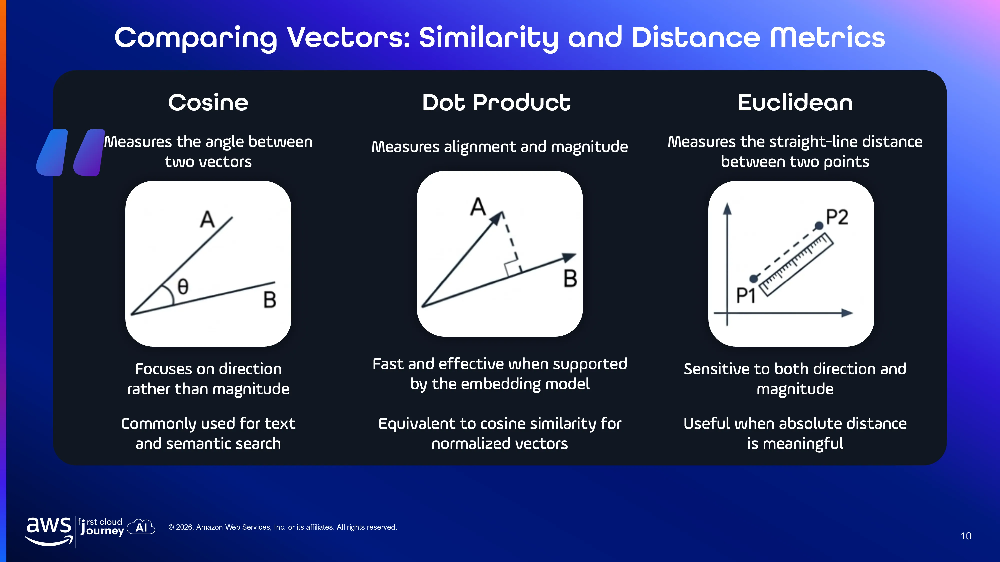

- **Cosine:** tập trung vào góc giữa hai vector, nên phù hợp khi direction biểu thị sự tương đồng về ý nghĩa quan trọng hơn độ dài vector.
- **Dot product:** kết hợp alignment và magnitude. Nó nhanh và hiệu quả khi đặc tính của embedding model được thiết kế để dùng metric này.
- **Euclidean:** đo khoảng cách đường thẳng giữa hai điểm, nên phản ánh cả direction lẫn magnitude.

Không có metric nào luôn đúng cho mọi bài toán. Metric phải nhất quán với embedding model và cách vector được chuẩn hóa; nếu chọn không phù hợp, hệ thống có thể xếp hạng các passage kém liên quan ở vị trí cao.

## 10. Amazon Bedrock Knowledge Bases đơn giản hóa RAG

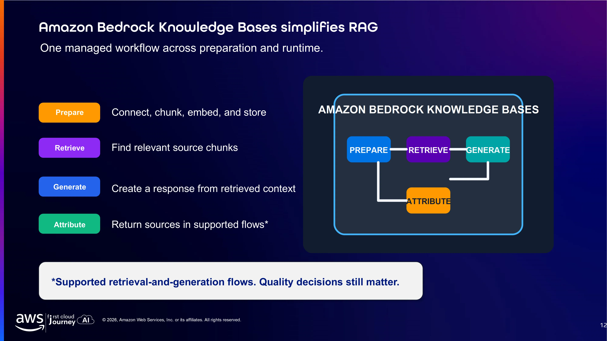

Amazon Bedrock Knowledge Bases gom các bước thường phải tự xây dựng thành một managed workflow. Giá trị chính không chỉ là lưu vector, mà là kết nối ingestion, indexing, retrieval và generation thành một luồng dễ vận hành hơn:

1. **Prepare:** connect, chunk, embed và store dữ liệu.
2. **Retrieve:** tìm các source chunks liên quan.
3. **Generate:** tạo response từ retrieved context.
4. **Attribute:** trả về sources trong các flow được hỗ trợ.

Attribution giúp liên kết response với nguồn trong những flow được hỗ trợ, nhưng không thay thế việc kiểm tra chất lượng dữ liệu và thiết kế retrieval. Managed service giảm công việc hạ tầng; nó không tự quyết định chunk nào là tốt, nguồn nào đáng tin hoặc câu trả lời có hoàn toàn đúng hay không.

## 11. Các lựa chọn vector store

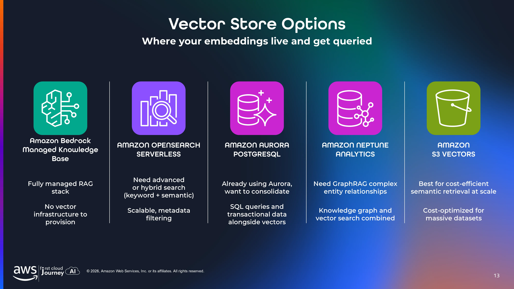

Vector store là lớp phục vụ việc lưu embeddings, tìm các vector gần nhau và thường áp dụng thêm metadata filtering. Lựa chọn phù hợp phụ thuộc vào kiểu truy vấn, dữ liệu hiện có, yêu cầu scale và mức độ managed mà đội ngũ mong muốn:

- **Amazon Bedrock managed Knowledge Base:** managed RAG stack, không cần tự provision vector infrastructure.
- **Amazon OpenSearch Serverless:** phù hợp advanced hoặc hybrid search, metadata filtering và khả năng mở rộng.
- **Amazon Aurora PostgreSQL:** phù hợp khi đã dùng Aurora, cần kết hợp SQL queries, transactional data và vectors.
- **Amazon Neptune Analytics:** phù hợp GraphRAG và các quan hệ entity phức tạp.
- **Amazon S3 Vectors:** hướng tới semantic retrieval tiết kiệm chi phí trên các dataset lớn.

## 12. Grounding tốt không đảm bảo câu trả lời luôn đúng

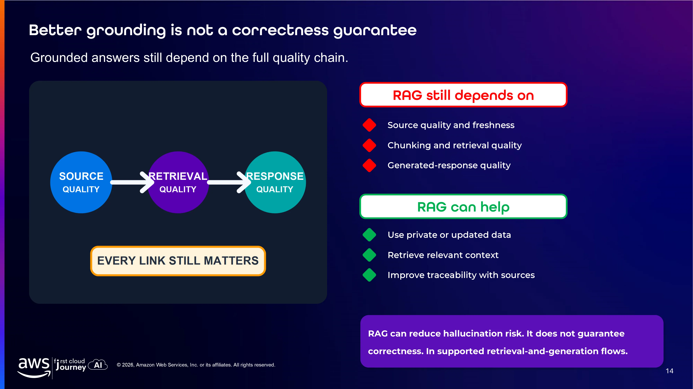

Grounding chỉ cải thiện đầu vào cho model; nó không biến mọi đầu vào thành sự thật. Chất lượng câu trả lời phụ thuộc vào cả chuỗi:

`Source quality → Retrieval quality → Response quality`

RAG có thể giúp:

- sử dụng dữ liệu private hoặc mới cập nhật;
- tìm context liên quan;
- cải thiện khả năng truy nguyên bằng sources.

Tuy nhiên, RAG không đảm bảo correctness tuyệt đối và không loại bỏ hoàn toàn hallucination. Một context sai, cũ hoặc bị cắt mất phần quan trọng vẫn có thể dẫn đến response sai. Ngay cả khi retrieval đúng, model vẫn có thể diễn giải quá mức hoặc kết hợp các nguồn không phù hợp.

## 13. Ba điều cần ghi nhớ

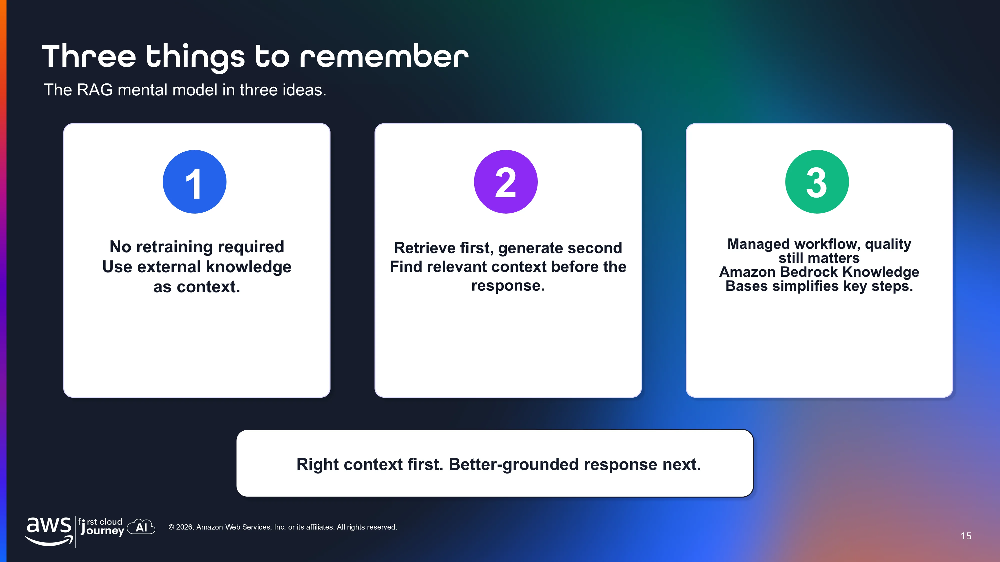

1. Không cần retraining: external knowledge được đưa vào như context tại thời điểm truy vấn.
2. Retrieve trước, generate sau: response tốt bắt đầu từ việc chọn đúng context.
3. Managed workflow nhưng quality vẫn quan trọng: Amazon Bedrock Knowledge Bases đơn giản hóa các bước chính, còn chất lượng vẫn phụ thuộc vào toàn bộ pipeline.

Ba ý này cũng cho thấy RAG là một kiến trúc phối hợp giữa search system và language model. Search quyết định model được nhìn thấy gì; model quyết định cách thông tin đó được diễn đạt.

> **Right context first. Better-grounded response next.**
